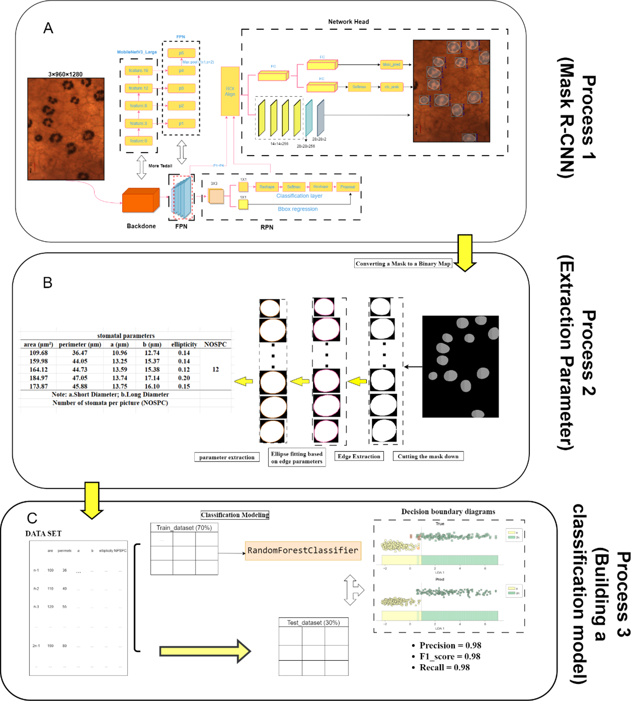
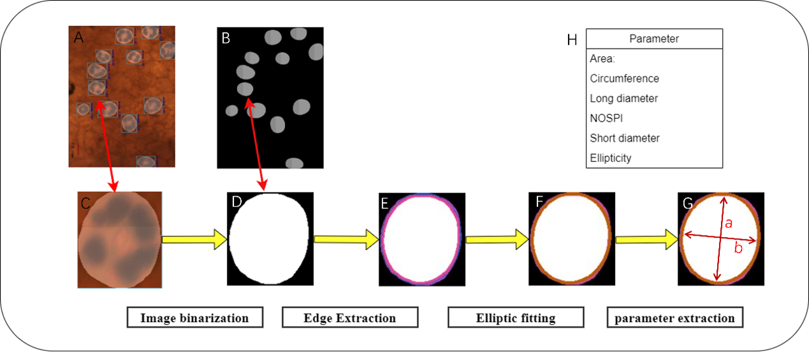

# 一个基于甜瓜(*Cucumis melo* L.)气孔图片，分类甜瓜单倍体与二倍体的Mask R-CNN模型

-----
## **项目简介**
单倍体技术可以极大促进作物育种，在QTL定位中也发挥着重要作用；2.单倍体的鉴定，是整个单倍体创制流程中最后一步；3.以往在葫芦科作物中，鉴定单倍体的手段有：根尖染色体观察、细胞流式仪；表型观察；4.但都具有各自的缺点，因此我们构建了一个快速的、准确的、经济的、自动的、基于甜瓜气孔性状的、深度学习分类模型。
--------
 
## **项目实现了2种类型的气孔分类模型**；
-----
1.基于甜瓜气孔图片的Mask R-CNN模型，-->提取气孔参数（气孔面积、气孔直径、短径、周长、离心率、每张图片上的气孔数量）--> 然后送入随机森林模型中进行分类；

2.基于甜瓜气孔图片的resnet34、resnet50、vgg16、MobileNetV3_Large、efficientnet_b0分类模型；
## 目录简介；
1. ----class_model----:分类模型的构建
2. ----edge_det----:mask r-cnn预测、图片二值化、边缘提取、椭圆拟合
3. ----hy_tools----:基于PyTorch的模型（5种不同的Backbone）训练、评估、保存、加载
4. ----output from_fea----:mask rcnn训练的评估文件
5. ----train_utils----:用于训练的工具
6. ----weights----:训练后的权重文件
7. ----SVM_or_RFores----:数据清洗，随机森林模型拟合

